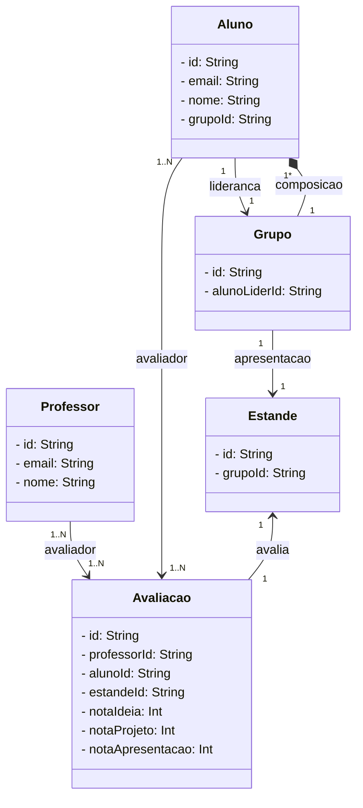

# TrabalhoPOO2

## Arthur Daleprani e Caio Sanches

## MiniMundo
A Universidade de Vila Velha realiza em seu campus todo ano o InovaWeek, evento de inovação e tecnologia.
Nesse evento há muitas apresentações realizadas por alunos, e essas avaliações são avaliadas por professores.
Os alunos formam grupos, onde há um lider, que é responsavel pelo grupo, porém a nota é igual para todos os integrante.
Cada grupo tem seu proprio estande, que é marcado por uma numeração, e cada professor recebe um numero X de estandes para avaliar,
por exemplo se ele receber 5 estandes, ele vai saber qual é a numeração de cada estante.

## Diagrama





# Para criar uma pasta em DevC

```cd ../../../..```

```ls```

```cd DevC```

```mkdir POOinova```

```cd POOinova```

```code .```

# Criar um projeto no node (package.json)

```npm init``` ou ```npm init -y```

# Para ajuda com "npm init"

```npm init --help```  ou ```npm help init```

# Instala a versão mais recente do TypeScript

```npm install --save-dev typescript```

# Inicializar TypeScript

```npx tsc --init```

# Reconstroi todas as dependências "node_modules"

```npm install```

# Baixa extensões no VS Code

SQLite Viewer

Prisma insider

VScode Icons


# Prisma
```npm install typescript ts-node @types/node --save-dev```

```npm install prisma --save-dev```

```npx prisma init --datasource-provider sqlite```

```npx prisma migrate dev --name init```

# Servidor
npm i express

npm install --save-dev @types/express

npx ts-node ./src/server.ts

# instalar ejs
npm install ejs
